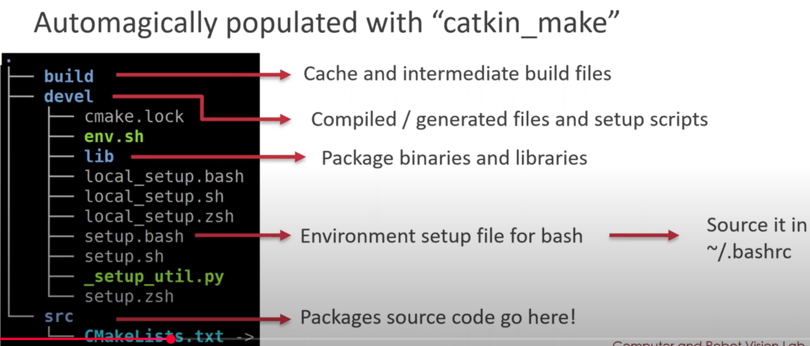

# intro_robotics
This repository contains coursework and practical implementations developed for the Introduction to Robotics module.

# getting started - eu fiz
to build a new Proj for robotics do:
`catkin_make` on the root of the project
- it preinstals some packages and downloads some stuff useful for ROS
- DO IT TO update CMakeLists if you make changes there

  

to create a package mais geral com verias dependencias:
`catkin_create_pkg <pakge name> <dependencies>`
no nosso caso : `catkin_create_pkg rob roscpp rospy std_msgs geometry_msgs`

if we want to modify: we can just run it again OR go into `src/<pakge name>/package_xml` e alterar as tags com mais packages
and then do: `source devel/setup.bash` to source the env

# Do this:
and add to .bashrc so you dont ahve oo source every time:
`echo "source ~/robotica/intro_robotics/devel/setup.bash" >> ~/.bashrc
source ~/.bashrc
`

Instal extensions for VSCODE! 
- ROS (não- deprecated)
- Robotics Developer Environment
- ROS snippets
- Cmake

for the next steps you gotta have Xserver:
try it with: `xeyes` (you should see eyes popping up)
To run gazebo (simulation):
run `sudo apt install ros-noetic-gazebo-ros-pkgs ros-noetic-gazebo-ros-control`
tryit by running : `gazebo`

`roslaunch husky_gazebo husky_playpen.launch` 
if you get error like `RLException: [husky_playpen.launch] is neither a launch file in package [husky_gazebo] nor is [husky_gazebo] a launch file name`
please do: (it will install the package)
`sudo apt update
sudo apt install ros-noetic-husky-simulator`

correr scripts:
`chmod +x <nome_script>.py`

para update src file:
`nano ~/.bashrc`
`source $HOME/robotica/intro_robotics/devel/setup.bash` OU `source ~robotica/intro_robotics/devel/setup.bash`
`source ~/.bashrc`

# SIMULAR
run `rostopic list` -- fazer `| grep <key_word>` para procurar coisa específica (ex: vel)

velocity: `rostopic info /cmd_vel`

        - apresenta subscriber/publisher nodes
        - tipo das msgs para o topico

to check msgs: `rosmsg list`
para verificar uma em especifico: `rosmsg show <nome_msg>` (ex: `rosmsg show std_msgs/Float32`)

b4 running subs e publishers: !!VERY IMPORTANT, DO THIS EVRY TIME
run: `roscore` -> é o master,, checks other nodes and tells them how to connect with eachother

to run subscriber:
`rosrun rob subscriber.py` (it will be listening for msgs)

to public msgs:
`rostopic pub [-r <Hz of frequency msg>] /<name_topic>` (experimentar fazer tab)

to launch the robot:
` rosrun rob publisher.py ` (this while `roslaunch husky_gazebo husky_playpen.launch` is still running!!)

Para correr logo o robo no husky sem ter de correr o publisher em separado:
`roslaunch rob launch_all.launch`